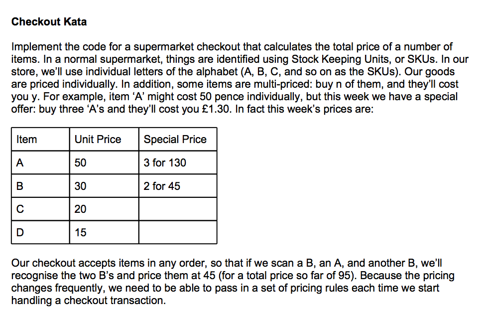
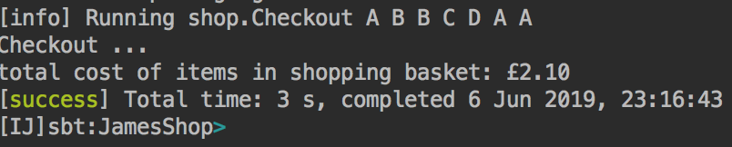
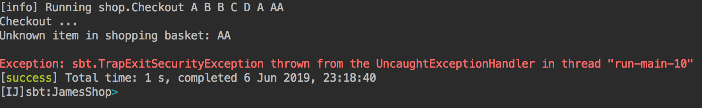

# Scala Tech Test Shop



## How to run

In Intellij, from the `sbt shell` input `run` with the names of the items.
E.g.
```$xslt
run A B B A C D A
```

If you are running `sbt` from the terminal:
E.g.
```$xslt
sbt "run A B B A C D A"
```

To run the tests, run the class:
```$xslt
src/test/scala/shop/CheckoutSpec.scala
```

## Result





## Author

James Palmer